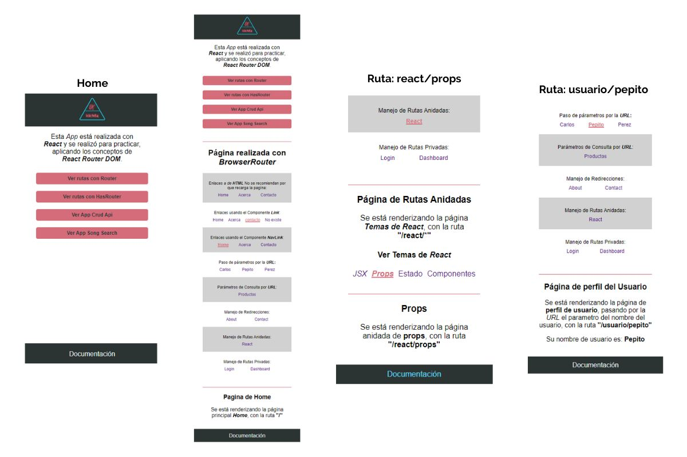
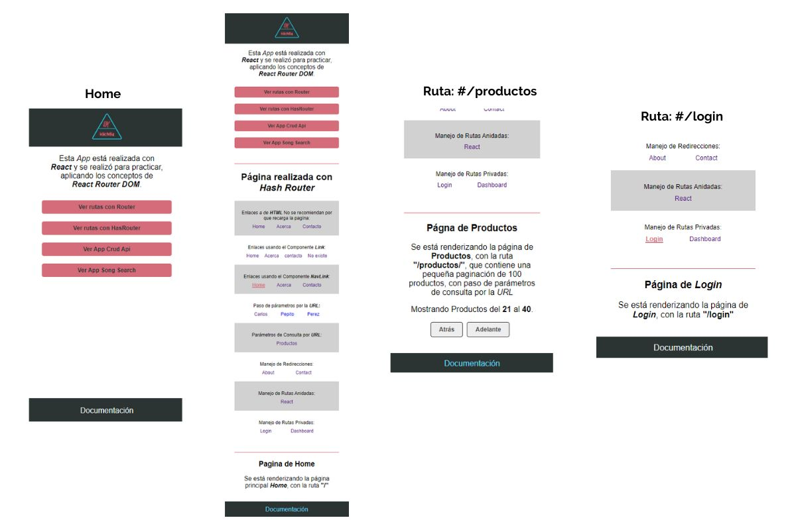
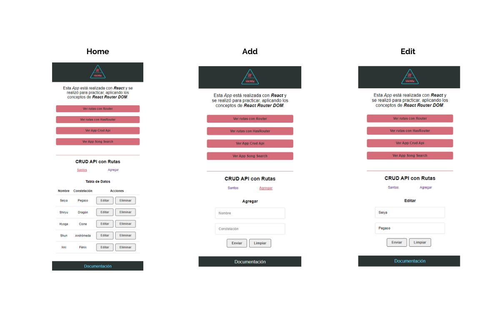
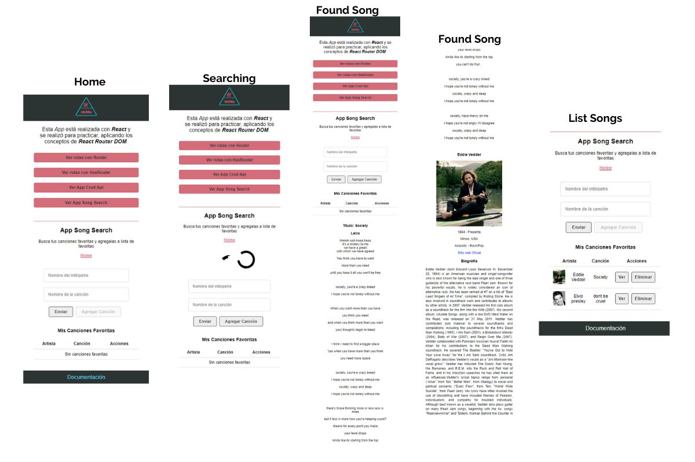

# App React Router DOM

App created to practice the concepts of the React Router DOM,
Following the course of REACT ([Link course](https://www.youtube.com/watch?v=MPLN1ahXgcs&list=PLvq-jIkSeTUZ5XcUw8fJPTBKEHEKPMTKk&ab_channel=jonmircha)) of the Jonathan Mircha's channel, in which you will four exercises.

- Concepts of the React Router DOM, in general, realized with BrowserRoute.

## App gif view

## App with BrowserRoute

---

- Concepts of the React Router DOM, in general, realized with HasRouter

## App with HasRouter

---

- CRUD application (made with JSON-server) and the Knights of the Zodiac theme

## CRUD API APP

---

- Application to save songs in local storage for data persistence, used for React router Dom routes and the consumption of two APIs
  [lyricsovh](https://lyricsovh.docs.apiary.io/#) and
  [theaudiodb](https://www.theaudiodb.com/api_guide.php)
  to get the lyrics and biography of the songs.

(these APIs are responding a bit slow, so the response may take up to a minute to arrive)

## Song Search APP

---

This app is created with Create React App ([Link documentation](https://github.com/facebook/create-react-app)).

To run this repository on your local pc you must copy all files in your PC.

`npm install`
`npm run start`

and you must also have json-server ([Link Documentation](https://www.npmjs.com/package/json-server)) installed and running it on a different port, a command was created in the package.json of this application that will start it on port 5000 with the command

`npm run fake-api`
