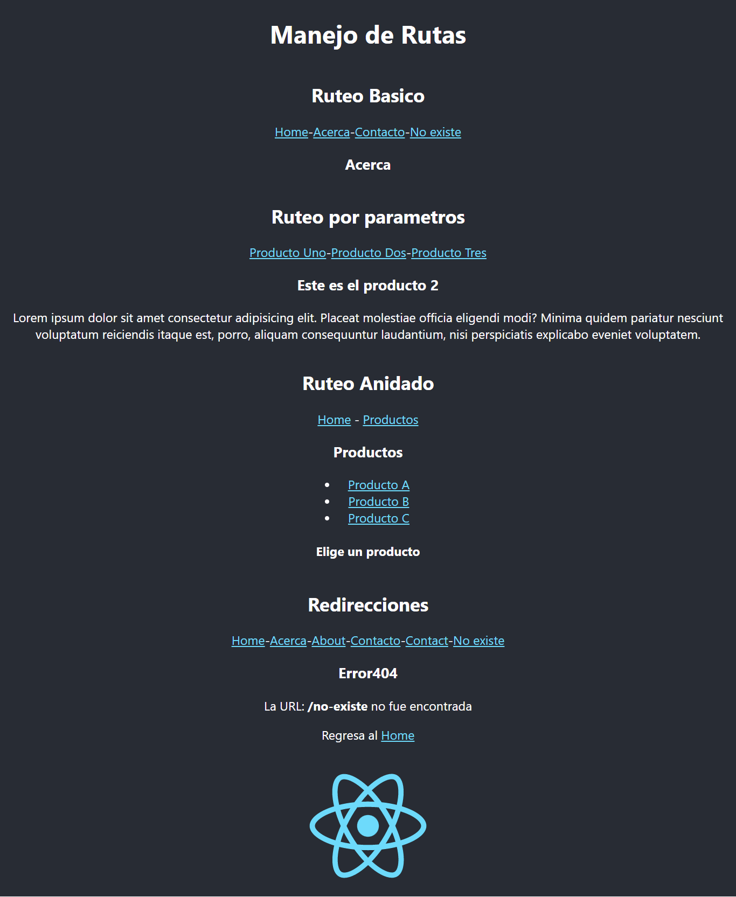

This project, was created with create-react-app.

To run locally, you must clone it "`git clone`" and from the root folder, run the command.

### `npm start`

---

# React-router Concepts

A simple example to learn the basic concepts of react-router.

- Basic routing
- Routing by Parameters
- Nested Routing
- Redirects

